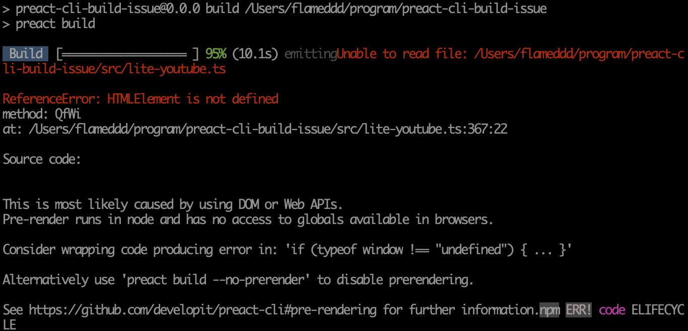

# preact-cli-build-issue reproduce build issue https://github.com/preactjs/preact-cli/issues/1469
This repo is reproduce `preact-cli` build, try to load an un-exist ts file.

I using a 3rd parity library, and build fail.  
- [@justinribeiro/lite-youtube](https://github.com/justinribeiro/lite-youtube)
- `@justinribeiro/lite-youtube`'s file structure and `package.json` are listed in below
  - `package.json`'s `main` and `module` are indicate to `lite-youtube.js`
  - **but** `preact-cli` try to load ts file (`lite-youtube.ts`)

problem can be solved by `--no-prerender` flag, **but is it normal ?**

## reproduce of steps
```
git clone https://github.com/flameddd/preact-cli-build-issue
cd preact-cli-build-issue
npm i
npm run build
```

  

## preact info
```
Environment Info:
  System:
    OS: macOS 10.15.2
    CPU: (4) x64 Intel(R) Core(TM) i5-4260U CPU @ 1.40GHz
  Binaries:
    Node: 10.15.1 - ~/.nvm/versions/node/v10.15.1/bin/node
    npm: 6.14.4 - ~/.nvm/versions/node/v10.15.1/bin/npm
  Browsers:
    Chrome: 86.0.4240.183
    Edge: 81.0.416.58
    Safari: 13.0.4
  npmGlobalPackages:
    preact-cli: 3.0.3
```

## `@justinribeiro/lite-youtube` file structure

```
.
./lite-youtube.d.ts
./LICENSE
./lite-youtube.js.map
./README.md
./package.json
./lite-youtube.js
```
## `@justinribeiro/lite-youtube` package.json
<details>
  <summary>Click to expand package.json</summary>
  
```json
{
  "_from": "@justinribeiro/lite-youtube",
  "_id": "@justinribeiro/lite-youtube@0.9.1",
  "_inBundle": false,
  "_integrity": "sha512-IgcpHnovzZGxU4Ec+0c7sSLhrJWflvYliQUmdcwBgyVkGw0ZL9Y8IU/m09NPk9EzIk2HAOWUGLywTVpB785egA==",
  "_location": "/@justinribeiro/lite-youtube",
  "_phantomChildren": {},
  "_requested": {
    "type": "tag",
    "registry": true,
    "raw": "@justinribeiro/lite-youtube",
    "name": "@justinribeiro/lite-youtube",
    "escapedName": "@justinribeiro%2flite-youtube",
    "scope": "@justinribeiro",
    "rawSpec": "",
    "saveSpec": null,
    "fetchSpec": "latest"
  },
  "_requiredBy": [
    "#USER",
    "/"
  ],
  "_resolved": "https://registry.npmjs.org/@justinribeiro/lite-youtube/-/lite-youtube-0.9.1.tgz",
  "_shasum": "c9f83861daad361d58de76b2a5e078de6fe6b751",
  "_spec": "@justinribeiro/lite-youtube",
  "_where": "/Users/flameddd/program/preact-cli-build-issue",
  "author": {
    "name": "Justin Ribeiro",
    "email": "justin@justinribeiro.com"
  },
  "bugs": {
    "url": "https://github.com/justinribeiro/lite-youtube/issues"
  },
  "bundleDependencies": false,
  "deprecated": false,
  "description": "A web component that loads YouTube embed iframes faster. ShadowDom based version of Paul Irish' concept.",
  "devDependencies": {
    "@typescript-eslint/eslint-plugin": "^2.29.0",
    "@typescript-eslint/parser": "^2.29.0",
    "eslint": "^6.8.0",
    "eslint-config-google": "^0.14.0",
    "eslint-config-prettier": "^6.10.0",
    "eslint-plugin-html": "^6.0.0",
    "eslint-plugin-lit": "^1.2.0",
    "prettier": "^2.0.0",
    "typescript": "^3.8.0"
  },
  "files": [
    "lite-youtube.d.ts",
    "lite-youtube.js",
    "lite-youtube.js.map"
  ],
  "homepage": "https://github.com/justinribeiro/lite-youtube#readme",
  "keywords": [
    "web components",
    "youtube"
  ],
  "license": "MIT",
  "main": "lite-youtube.js",
  "module": "lite-youtube.js",
  "name": "@justinribeiro/lite-youtube",
  "repository": {
    "type": "git",
    "url": "git+ssh://git@github.com/justinribeiro/lite-youtube.git"
  },
  "scripts": {
    "build": "tsc --project tsconfig.json",
    "lint": "npm run lint:eslint && npm run lint:prettier",
    "lint:eslint": "eslint *.ts --ignore-path .gitignore",
    "lint:prettier": "prettier --check *.ts --ignore-path .gitignore",
    "prepublishOnly": "npm run build"
  },
  "types": "lite-youtube.d.ts",
  "version": "0.9.1"
}

```
</details>
